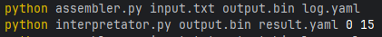
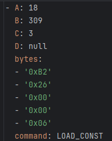
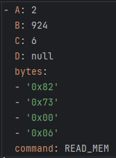
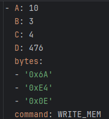
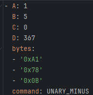
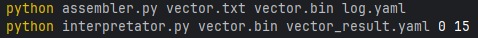
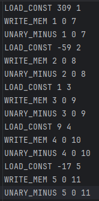
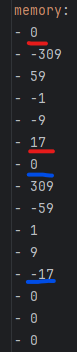

Задание №4 

Разработать ассемблер и интерпретатор для учебной виртуальной машины 
(УВМ). Система команд УВМ представлена далее.

Для ассемблера необходимо разработать читаемое представление команд 
УВМ. Ассемблер принимает на вход файл с текстом исходной программы, путь к 
которой задается из командной строки. Результатом работы ассемблера является 
бинарный файл в виде последовательности байт, путь к которому задается из 
командной строки. Дополнительный ключ командной строки задает путь к файлу
логу, в котором хранятся ассемблированные инструкции в духе списков 
“ключ=значение”, как в приведенных далее тестах. 

Интерпретатор принимает на вход бинарный файл, выполняет команды УВМ 
и сохраняет в файле-результате значения из диапазона памяти УВМ. Диапазон 
также указывается из командной строки. 

Форматом для файла-лога и файла-результата является yaml. 

Необходимо реализовать приведенные тесты для всех команд, а также 
написать и отладить тестовую программу. 

Загрузка константы

| A        | B         | C          |  
|----------|-----------|------------|  
| Биты 0-4 | Биты 5-32 | Биты 33-35 | 
| 18       | Константа | Адрес      |

Размер команды: 5 байт. Операнд: поле B. Результат: регистр по адресу, 
которым является поле C. 

Тест (A=18, B=309, C=3): 

0xB2, 0x26, 0x00, 0x00, 0x06  

Чтение значения из памяти

| A        | B         | C          |  
|----------|-----------|------------|  
| Биты 0-4 | Биты 5-23 | Биты 24-26 | 
| 2        | Адрес     | Адрес      |

Размер команды: 4 байт. Операнд: значение в памяти по адресу, которым 
является поле B. Результат: регистр по адресу, которым является поле C. 

Тест (A=2, B=924, C=6): 

0x82, 0x73, 0x00, 0x06 

Запись значения в память 

| A        | B        | C         | D      |  
|----------|----------|-----------|--------|  
| Биты 0-4 | Биты 5-7 | Биты 8-10 | 11-21  |
| 10       | Адрес    | Адрес     | Смещение   |

Размер команды: 3 байт. Операнд: регистр по адресу, которым является поле 
B. Результат: значение в памяти по адресу, которым является сумма адреса 
(регистр по адресу, которым является поле C) и смещения (поле D). 

Тест (A=10, B=3, C=4, D=476): 

0x6A, 0xE4, 0x0E

Унарная операция: унарный минус

| A      | B        | C         | D        |  
|--------|----------|-----------|----------|  
| Биты 0-4 | Биты 5-7 | Биты 8-10 | 11-21    |
| 1      | Адрес    | Адрес     | Смещение |

Размер команды: 3 байт. Операнд: значение в памяти по адресу, которым 
является сумма адреса (регистр по адресу, которым является поле C) и смещения 
(поле D). Результат: регистр по адресу, которым является поле B. 

Тест (A=1, B=5, C=0, D=367): 

0xA1, 0x78, 0x0B

Описание функций

Ассемблер:

instruction_to_bytes(instruction, size)

Преобразует числовое значение инструкции в массив байтов заданного размера. 
Возвращает байты в формате 0xXX.

assemble(input_file, output_file, log_file)

Собирает инструкции из текстового файла и переводит их в бинарный формат.
На выходе получается бинарный файл с инструкциями и 
лог-файл в формате YAML с подробным описанием каждой команды.

Интерпретатор:

extract_signed_field(value, shift, size)

Извлекает поле заданного размера и сдвига из числа, 
интерпретируя его как положительное.

extract_minus_field(value, shift, size)

Аналогична extract_signed_field, 
но учитывает возможное представление отрицательных значений.

interpret(binary_file, result_file, memory_range)

Интерпретирует бинарный файл, выполняя команды в памяти.
Читает бинарный файл, интерпретирует инструкции, обновляет состояние памяти.
Создает лог с деталями выполнения (включая снимки памяти) и сохраняет в YAML.
Параметры памяти: задаются диапазоном memory_range.

Проверка тестов для отдельно взятой операции

Запуск программы 

Загрузка константы - LOAD_CONST B C

Тест, взятый из условия:

LOAD_CONST 309 3

Результат работы ассемблера. Файл логов 
(для проверки с ожидаемыми данными в тесте, в задании):

Чтение значения из памяти - READ_MEM B C

Тест, взятый из условия:

READ_MEM 924 6

Результат работы ассемблера. Файл логов  
(для проверки с ожидаемыми данными в тесте, в задании):

Запись значения в память - WRITE_MEM B C D

Тест, взятый из условия:

WRITE_MEM 3 4 476

Результат работы ассемблера. Файл логов  
(для проверки с ожидаемыми данными в тесте, в задании):

Унарная операция: унарный минус - UNARY_MINUS B C D

Тест, взятый из условия:

UNARY_MINUS 5 0 367

Результат работы ассемблера. Файл логов  
(для проверки с ожидаемыми данными в тесте, в задании):

Тестовая программа 

Запуск программы:

Выполнить поэлементно операцию унарный минус над вектором длины 5. 
Результат записать в новый вектор. 

Входной файл vector.txt

Результат:

Внутри красных полос получившийся вектор, ниже - в синих - исходный

